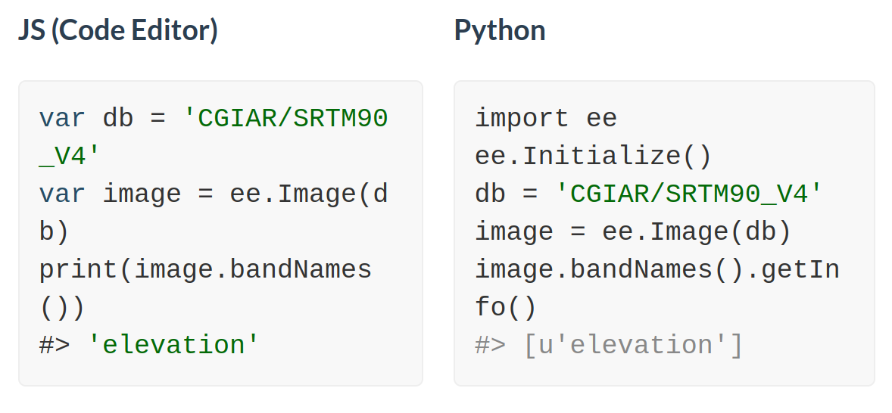
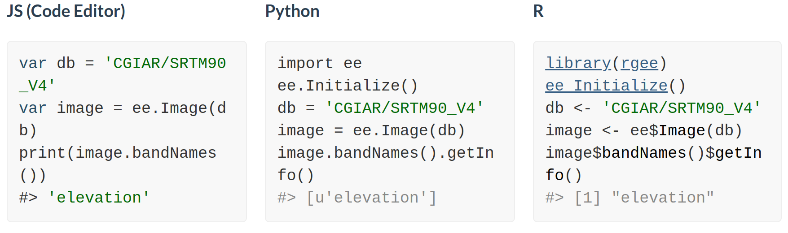
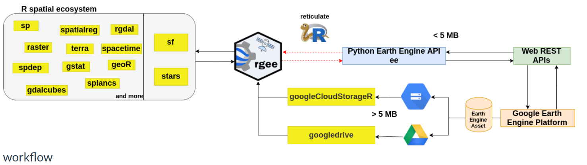

```{r setup, include = FALSE}
# loading libraries
library(tidyverse)
library(palmerpenguins)
library(fontawesome)

# preset code chunk options
knitr::opts_chunk$set(dpi = 300,            # ensures high resolution images
                      echo = FALSE,         # FALSE: code chunks don't show
                      warning = FALSE,      # FALSE: suppresses warning messages
                      error = FALSE)        # FALSE: Suppresses error messages
```

class: title-slide, center, bottom, inverse
background-image: url(img/rgee-hex.png)
background-position: top
background-size: 40%

# `r rmarkdown::metadata$title`

Tainá Rocha

???
This slide uses:
- a custom `title-slide` class that removes the slide number from the title slide
- a background image
  - background-image: url(img/PurpleSky.jpg)
  - background-position: bottom
  - background-size: cover

---
# Roteiro

- Google Earth Engine (GEE) : Infraestrutura, catálago de dados

- rgee, o fluxo de trabalho


- rgee na prática (R/Rstudio)

???

- Vou falar  mostrar o que é/ ou do que se trata Google Earth Engine. Mostrando de forma geral a infraestrutura, o catalágo de dados.
- Depois vou mostrar o pacote rgee. Começando pela instalação que não é algo tão trivial, tem alguns requisitos. Mas também não é algo díficl de outro mundo. Mostraei a sintaxe do pacote. 
- Finalizo mostrando estudos de caso

---

.left-column[
# GEE

]

.right-column[

```{r url homepage GEE, echo=FALSE}
knitr::include_url("https://earthengine.google.com/", height = 500)
```

.footnote[https://developers.google.com/earth-engine/datasets/]
]

???

- O GEE é dos serviços oferecidos pelo google. É uma plataforma que além de hospedar dados geoespaciais, oferece uma infraesturtura computacional para análise desses dados. 
- Essa é a página inicial do GEE e você encontra várias informações interessantes,sobre como funciona essa infraestrutura. 
- E o  grande potencial da plataforma, pelo menos até agora é possibilidade de acessar gratutitamente um serviço de alta pefomance, gratuito até certo ponto. Além dessa possibilidade de ter um catálago dados. 
- E só pra explicar/ contextulizar melhor sobre essa necessidade de alta perfomance. Isso acontece pela necessidade de termos dados mais refinadso, com mais informação. E Isso acontece em diferentes áreas. Exmplo da figura 
- Clicando aqui vocês são direcionados para a página do catálogo de dados, onde você podem acessar os mais diferentes tipos de dados, ou procurar por algum por outros dados. Enfim, é uma das seções que eu mais utilizo.

---
### Volume de dados | Resolução de dados -> Demanda por processamento de alta perfomance 

```{r res, echo=FALSE, out.width="100%", fig.align="center"}
knitr::include_graphics("img/res.png")
```
???
- Pra exemplificar isso essa figura mostra dados to tipo raster, dados matricias. E Basicamente é uma imagem composta por pixeis, onde cade pixel carrega uma informação, nesse caso aqui é informaçõa de temperatura, ou seja eu tenho valores de temperatura para cada pixel.  E numa resolução baixa/grosseira os pixeis são maiores, mas estão menor quantidade, ou seja eu vou ter poucos valores para serem analisados ou processados. Já um dados em alta resolução número de pixeis aumenta exponencialmente, e aí a gente passa a ter muito valores para analisar e processar.... o que gera uma demanda por alta perfomance. E daí a importância da plataforma como Engine que te oferece gratuitamente essa infraestrutura.

---
### Infraestrutura do GEE - JavaScript ou Phyton 

--
```{r js_py, echo=FALSE, out.width="70%", fig.align="center"}

```
--
Code editor : https://code.earthengine.google.com/
```{r cejs, echo=FALSE, out.width="70%", fig.align="center"}
knitr::include_graphics("img/cejs.png")
```
???
Contudo, a google disponibiliza este serviço em Javascript ou Phyton... Na verdade o editor próprio da plataforma engine e em JS. E isso acaba gerando alguma restrição para quem não tem habilidade com essas linguagens.

---
### Infraestrutura do GEE - JavaScript ou Phyton 

```{r R, echo=FALSE, out.width="100%", fig.align="center"}

```
--
```{r paper, echo=FALSE}
knitr::include_url("https://www.theoj.org/joss-papers/joss.02272/10.21105.joss.02272.pdf", height = 350)

```
???
- E foi assim que esse grupo de pesquisadores de diferentes departamentos criaram a alternativa em R para o acesso ao Google Earth Engine. Para nossa sorte. 

- Aqui nesse artigo vocês econtram várias informções sobre o rgee. E o pacote também já está no cran. 

---
class: top, center

### Fluxo de Trabalho do rgee
<br>
<br>
<br>
<br>
```{r workflow, echo=FALSE, out.width="100%", fig.align='center'}

```
.footnote[https://r-spatial.github.io/rgee/"]
???
- Esse aqui é fluxo de trabalho do rgee. E resumidamente, o rgee feito em R, conversa muito bem com os principais pacotes R de análises espaciais , que ele chama aqui de ecossistema espacial R. Mas o rgee consegue também conversar com API Python do Earth Engine, graças ao pacote reticulate, que traduz tudo o que é feito no rgee, que na verdade são requisições feitas no rgee que o reticulate traduz para a API python e API por sua vez transforma essa requisição em um JSON que é o formato aceito aqui na plataforma Earth Engine . 

---
### Requisitos para o uso do GEE e rgee :
<br>
<br>

--

Conta google (com o Earth Engine ativado)

--

* https://www.google.com/intl/pt-BR/account/about/

* https://earthengine.google.com/

--

Python >= v3.5

--

* [Windows](https://www.python.org/downloads/windows/)

* [Mac](https://www.python.org/downloads/macos/)

--

EarthEngine Python API - Python package*

---
### Referências

- Aybar, C., Wu, Q., Bautista, L., Yali, R., & Barja, A. (2020). rgee: An R package for interacting with Google Earth Engine. Journal of Open Source Software, 5(51), 2272.

- [Documentação](https://cran.r-project.org/web/packages/rgee/vignettes/rgee01.html)

- [Instalações](https://r-spatial.github.io/rgee/articles/rgee01.html#installation)

- [Tutorial](http://www.css.cornell.edu/faculty/dgr2/_static/files/R_html/ex_rgee.html)

- [Repositório](https://github.com/r-spatial/rgee)

- [rgeeExtra](https://r-earthengine.com/rgeeExtra/), extensão para o rgee 

- [rgee examples](https://csaybar.github.io/rgee-examples/)

- [Código](https://github.com/Tai-Rocha/RLadies_rgee.github.io/blob/main/R/rgee_exemplos.R), prática/exemplos 
???
 - Nas referências eu deixei vários conteúdos com informações mais detalhadas.
 - E agora eu vou pro R , mostrar um pouco o que dá pra fazer com o rgee.as

---
class: middle, inverse, title-slide

.pull-left[
<br/>
<br/>
<br/>
<br/>
<br/>
<br/>
# Obrigada!
<br/>

]

.pull-right[

### `r rmarkdown::metadata$author`


### `r rmarkdown::metadata$role`

### `r rmarkdown::metadata$org`

[`r fontawesome::fa("github")` @Tai-Rocha](https://github.com/Tai-Rocha)    
[`r fontawesome::fa("twitter")` @Tai_Rocha_](https://twitter.com/Tai_Rocha_)   
[`r fontawesome::fa("link")` tainaweb-en.netlify.app](https://tainaweb-en.netlify.app/)
]

???
Thank you for joining me!
You can find my contact information linked on this slide if you want to get in touch, and I'm happy to take any questions.

This slide also uses:
- the `title-slide` class, to remove the slide number at the bottom
