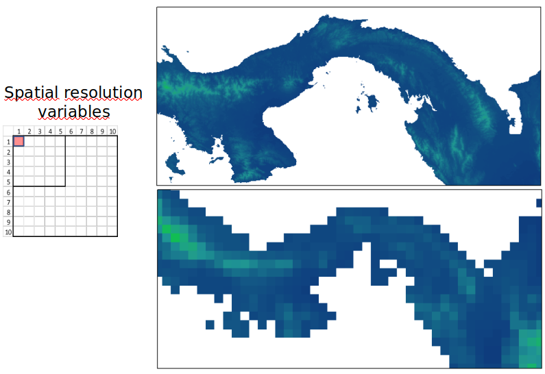

```{r setup, include = FALSE}
# loading libraries
library(tidyverse)
library(palmerpenguins)
library(fontawesome)

# preset code chunk options
knitr::opts_chunk$set(dpi = 300,            # ensures high resolution images
                      echo = FALSE,         # FALSE: code chunks don't show
                      warning = FALSE,      # FALSE: suppresses warning messages
                      error = FALSE)        # FALSE: Suppresses error messages
```

class: title-slide, center, bottom, inverse
background-image: url(img/rgee-hex.png)
background-position: top
background-size: 40%

# `r rmarkdown::metadata$title`

Tainá Rocha

???
This slide uses:
- a custom `title-slide` class that removes the slide number from the title slide
- a background image
  - background-image: url(img/PurpleSky.jpg)
  - background-position: bottom
  - background-size: cover

---
class: inverse, middle, center


# R-Ladies Global 

[`r fontawesome::fa("link", a11y = "sem", fill = "#FFFFFF")` rladies.org](https://rladies.org)<br/>
[`r fontawesome::fa("twitter", a11y = "sem", fill = "#FFFFFF")` @RLadiesGlobal](https://twitter.com/rladiesglobal)<br/>
[`r fontawesome::fa("paper-plane", a11y = "sem", fill = "#FFFFFF")` info@rladies.org](mailto:info@rladies.org)<br>
[`r fontawesome::fa("slack", a11y = "sem", fill = "#FFFFFF")` Join the Slack](https://rladies-community-slack.herokuapp.com/)

???
Hello! My name is R-Ladies Global and I'm excited to be here to help promote gender diversity in the R community.

This slide uses:
- `rmarkdown::metadata` to access YAML metadata
- icons from the fontawesome package with the `ally = "sem"` (semantic attribute) accessibility feature.
- image inserted using html code and including the alternative text attribute

--

If you like this R-Ladies themed xaringan template, you can copy it to your computer: **usethis::use_course("spcanelon/RLadies-xaringan-template")**

And learn how to deploy xaringan slides to GitHub Pages in this blog post:<br> [silvia.rbind.io/2021-03-16-deploying-xaringan-slides](https://silvia.rbind.io/2021-03-16-deploying-xaringan-slides)

???
This slide uses:
- the `inverse`, `middle`, and `center` slide classes
- an image inserted with html

---
# Roteiro

- Google Earth Engine (GEE) : infraestrutra, catálago de dados

- rgee: fluxo de trabalho, instalções, funções 


- Estudos de caso: coletando os dados , x, y

???

- Vou falar  mostrar o que é/ ou do que se trata Google Earth Engine. Mostrando de forma geral a infraestrutura, o catalágo de dados.
- Depois vou mostrar o pacote rgee. Começando pela instalação que não é algo tão trivial, tem alguns requisitos. Mas também não é algo díficl de outro mundo. Mostraei a sintaxe do pacote. 
- Finalizo mostrando estudos de caso

---

.left-column[
# GEE

]

.right-column[

```{r url homepage GEE, echo=FALSE}
knitr::include_url("https://earthengine.google.com/", height = 500)
```

.footnote[https://developers.google.com/earth-engine/datasets/]
]

???

- O GEE é dos serviçoes do google, é uma plataforma que além de hospedar dados geoespaciais, oferece uma infraesturtura para análise desses dados. 
- Essa é a página inicial do GEE e você encontra várias informações interessantes,sobre como funciona essa infraestrutura. 
- E o  grande potencial da plataforma, pelo menos até agora é possibilidade de acessar gratutitamente um serviço de alta pefomance, isso pq além de acessar gratuitamente os dados que estão estão cada vez mais em alta resolução, você consegue realizar análises de alta complexidade que requer poder de processamento. E agora eu volto para os slides.
- Clicando aqui vocês são direcionados para a página do catálogo de dados, onde você podem acessar os mais diferentes tipos de dados, ou procurar por algum por outros dados. Enfim, é uma das seções que eu mais utilizo.

---
### Volume de dados | Resolução de dados -> Demanda por processamento de alta perfomance 

```{r res, echo=FALSE, out.width="100%", fig.align="center"}

```
???
- Pra exemplificar isso essa figura mostra dados to tipo raster, dados matricias. E Basicamente é uma imagem composta por pixeis, onde cade pixel carrega uma informação, nesse caso aqui é informaçõa de temperatura, ou seja eu tenho valores de temperatura para cada pixel.  E numa resolução baixa/grosseira os pixeis são maiores, mas estão menor quantidade, ou seja eu vou ter poucos valores para serem analisados ou processados. Já um dados em alta resolução número de pixeis aumenta exponencialmente, e aí a gente passa a ter muito valores para analisar e processar.... o que gera uma demanda por alta perfomance. E daí a importância da plataforma como Engine que te oferece gratuitamente essa infraestrutura.

---
### Infraestrutura do GEE - JavaScript ou Phyton 

--
```{r js_py, echo=FALSE, out.width="70%", fig.align="center"}

```
--
Code editor : https://code.earthengine.google.com/
```{r cejs, echo=FALSE, out.width="70%", fig.align="center"}
knitr::include_graphics("img/cejs.png")
```
???
Contudo, a google disponibiliza este serviço em Javascript ou Phyton... Na verdade o editor próprio da plataforma engine e em JS. E isso acaba gerando alguma restrição para quem não tem habilidade com essas linguagens.

---
### Infraestrutura do GEE - JavaScript ou Phyton 

```{r R, echo=FALSE, out.width="100%", fig.align="center"}

```
--
```{r paper, echo=FALSE}
knitr::include_url("https://www.theoj.org/joss-papers/joss.02272/10.21105.joss.02272.pdf", height = 350)

```
???
- E foi assim que esse grupo de pesquisadores de diferentes departamentos criaram a alternativa em R para o acesso ao Google Earth Engine. Para nossa sorte. 

- Aqui nesse artigo vocês econtram várias informções sobre o rgee. E o pacote também já está no cran. 

---
class: top, center

### Fluxo de Trabalho do rgee
<br>
<br>
<br>
<br>
```{r workflow, echo=FALSE, out.width="100%", fig.align='center'}

```
.footnote[https://r-spatial.github.io/rgee/"]
???
- Esse aqui é fluxo de trabalho do rgee. E resumidamente, o rgee feito em R, conversa muito bem com os principais pacotes R de análises espaciais , que ele chama aqui de ecossistema espacial R. Mas o rgee consegue também conversar com API Python do Earth Engine, graças ao pacote reticulate, que traduz tudo o que é feito no rgee, que na verdade são requisições feitas no rgee que o reticulate traduz para a API python e API por sua vez transforma essa requisição em um JSON que é o formato aceito aqui na plataforma Earth Engine . 

---
### Requistos para o uso do GEE e rgee :
<br>
<br>

--

Conta google (com o Earth Engine ativado)

--

* https://www.google.com/intl/pt-BR/account/about/

* https://earthengine.google.com/

--

Python >= v3.5

--

* [Windows](https://www.python.org/downloads/windows/)

* [Mac](https://www.python.org/downloads/macos/)

--

EarthEngine Python API - Python package*

---
### Referências

- Aybar, C., Wu, Q., Bautista, L., Yali, R., & Barja, A. (2020). rgee: An R package for interacting with Google Earth Engine. Journal of Open Source Software, 5(51), 2272.

- [Documentação](https://cran.r-project.org/web/packages/rgee/vignettes/rgee01.html)

- [Tutorial](http://www.css.cornell.edu/faculty/dgr2/_static/files/R_html/ex_rgee.html)

- [Repositório](https://github.com/r-spatial/rgee)

- [rgeeExtra](https://r-earthengine.com/rgeeExtra/), extensão para o rgee 

- [rgee examples](https://csaybar.github.io/rgee-examples/)

- [Código](https://github.com/Tai-Rocha/VI_SER_talk.github.io/blob/main/R/rgee_exemplos.R),estudos de caso
???
 - Nas referências eu deixei vários conteúdos com informações mais detalhadas.
 - E agora eu vou pro R , mostrar um pouco o que dá pra fazer com o rgee.as

---
# Inserting images

```{r, echo = TRUE, fig.alt="World map with countries that have R-Ladies chapters highlighted in purple"}
knitr::include_graphics("img/RLadiesMap.png")
```

--

> Note: You can use the `fig.alt` code chunk option to add alternative text to your images, that way they are accessible to screen reader users:
- In code chunk: `{r, fig.alt = "<descriptive alt text>"}`.
- Read more about this in [{knitr} NEWS.md](https://github.com/yihui/knitr/blob/master/NEWS.md#new-features-1)

???
This slide uses:
- an image inserted with `knitr::include_graphics()`
- the `fig.alt =` code chunk option for alternative text

---
# Tables and quotes

### Table

.pull-left[

`palmerpenguins::penguins`

The `penguins` dataset contains size measurements for adult penguins nesting near Palmer Station in Antarctica.

Measurements like `body_mass_g`
]

.pull-right[

```{r}
palmerpenguins::penguins %>%
  select(species, island, body_mass_g) %>%
  arrange(body_mass_g) %>%
  head() %>%
  knitr::kable(format = 'html')
```
]

???
This slide uses:
- the `.pull-left[]` and `.pull-right[]` classes
- an R code chunk to produce the html table

--

### Quote

> You can read more about the `palmerpenguins` data package authored and maintained by Allison Horst at [allisonhorst.github.io/palmerpenguins](https://allisonhorst.github.io/palmerpenguins/)

???
- a quote with `>`

---
# Highlighting code

`> This is what inline code looks like`

You can highlight lines of code within code chunks using `#<<`:

### Code

```r
palmerpenguins::penguins %>%
  ggplot(aes(x = island, y = body_mass_g)) +
  geom_boxplot(aes(fill = island))               #<<
```

### Output

```{r eval=FALSE, echo=TRUE}
palmerpenguins::penguins %>%
  ggplot(aes(x = species, y = body_mass_g)) +
  geom_boxplot(aes(fill = island))               #<<
```

???
This slide uses:
- inline code highlighting with backticks ` `` `
- a code chunk to produce a ggplot

---

```{r penguin-body-mass, eval=TRUE, echo=TRUE, fig.height = 4.5}
palmerpenguins::penguins %>%
  ggplot(aes(x = species, y = body_mass_g)) +
  geom_boxplot(aes(fill = island))               
```

???
This slide uses:
- a code chunk to produce a ggplot
- code chunk option `fig.height = 4.5` to control the figure height

---
class: middle, inverse, title-slide

.pull-left[
# Thank you!
<br/>
## R-Ladies Global  

### Promoting gender diversity in the R community
]

.pull-right[
.right[


[`r fontawesome::fa("link", a11y = "sem", fill = "#FFFFFF")` rladies.org](https://rladies.org)<br/>
[`r fontawesome::fa("twitter", a11y = "sem", fill = "#FFFFFF")` @RLadiesGlobal](https://twitter.com/rladiesglobal)<br/>
[`r fontawesome::fa("paper-plane", a11y = "sem", fill = "#FFFFFF")` info@rladies.org](mailto:info@rladies.org)<br>
[`r fontawesome::fa("slack", a11y = "sem", fill = "#FFFFFF")` Join the Slack](https://rladies-community-slack.herokuapp.com/)
]]

???
Thank you for joining me!
You can find my contact information linked on this slide if you want to get in touch, and I'm happy to take any questions.

This slide also uses:
- the `title-slide` class, to remove the slide number at the bottom
